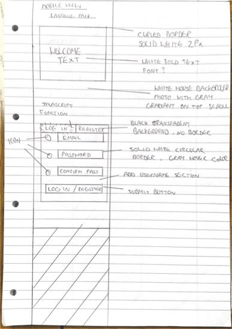
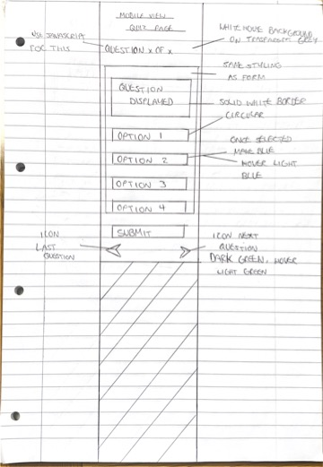
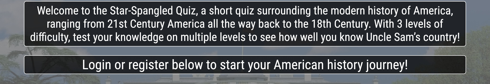
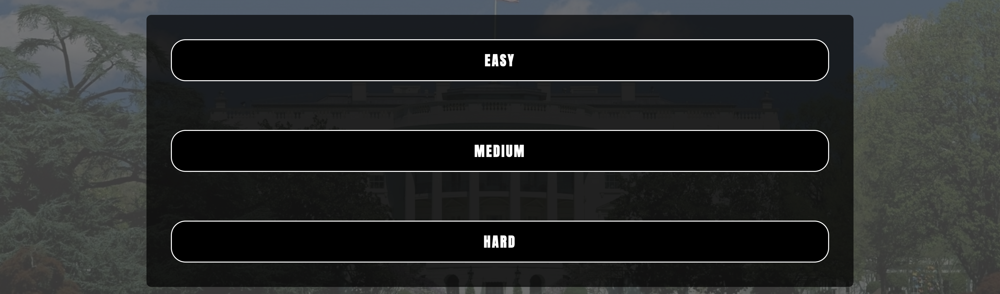

### The Star-Spangled Quiz

Welcome to the Star Spangled Quiz, a quiz surrounding American History from modern day America, right through to the 18th Century. 

## Introduction

### A Brief Overview

- The purpose of the American History Quiz is to provide students and quiz-enthusiasts alike a vague introduction into American History through the means of engaging in a short but sweet quiz which has 3 levels of difficulty for the challenger. 

- The questions provided within the quiz of course all surround American historty, from rather obscure questions regarding former Presidents of the country, through to general questions concerning the geography of the 50 states, the quiz is jam packed with an array of questions where every challenger is sure to learn something new. 

### Target Audience

- The target audience of the Star Spangled Quiz are mainly history students and quiz-enthusiasts, as well as the members of the general public who enjoy engaging in the odd quiz from time to time. 

- With the demand for pub quizzes rising throughout the country, a website where the challenger can cycle through 3 different levels of difficulty surrounding the same topic would be highly welcomed. 

## Wireframing

- Here are the screenshots of the initial wireframes I had created for the quiz website. I have drafted a wireframe for the landing page with the welcome text and registration form, as well as a wireframe for the quiz window.

- The use of wireframing is beneficial to myself and the reader. 
    - Firstly myself as this allows me to visualise how I want the website to look, and therefore I can begin consider how I will structure this with HTML and CSS. Once the design basics have been noted, I am able to visualise the JavaScript with a considerable amount of depth. Working to a plan presents better results.

    - Secondly, this will benefit the reader as it will allow them to see the thought process behind the features. Any final features that have changed compared to the wireframe will be documented with an explanation, giving the reader an insight as to why this has changed.

### Landing Page Wireframe

- **Background**
    - The background is set to be an image of the White House with a gray gradient over the top of it. This is to fit the aesthetic of the quiz being a historical theme focused around American history. The gray gradient over the image will further reinforce this.
    - Furthermore, gray is a high constrast color this meaning that the majority of colors used will provide an excellent contrast against this background. Not only will this aid visually-impaired users, this will also produce a sleek design capable of adopting almost any color pallet. 

- **Welcome Text**
    - Within the box titled 'welcome text', the description of the websitev at hand can be found, giving the user a sucinct insight of what to expect within the website.
    - A prompt encouraging the user to scroll down will be present too, advising them to scroll down and begin the quiz.
    - In terms of style, the box will have a white, curved border of 2pixels, giving it a contrast to the aforementioned gray background of the body. The text within this box will also be white, again giving it a contrast to the background allowing more accessiblity for the user. 

- **Login Form**
    - Underneath the welcome text there is a registration/login form where the user can either sign up or log in to their account on the quiz website. With the help of JavaScript, the user will be able to toggle between 'log-ign' and 'sign-up' using two buttons at the top of the form. This will ensure that both log-in options are contained within the same box for convenience; however this also has a sleek look to it improving the user's experience. 
    - With the use of JavaScript, the form shall have multiple levels of validation regarding both the username and the password, this ensures that the user will not be able to create a week password or username - thus protecting their data whilst using the website. The form's of validation will ensure that the 'password' and 'confirm password' fields match, that the password is of a certain length, and that it must contain a number. 
    - For the aesthetic of the form, it shall fdllow suit with the rest of the website's color pallet. White text contained within a black box with a white border of 2px. Through keeping up the website's aesthetic with the form, this reinforces a positive experience for the user. 

### Quiz Window Wireframe

- **Question Counter**
    - Right at the top of the quiz window the user will be able to see the question number that they are on. This will be displayed as 'Question X of X', through allowing the user to see what question number they are on this will make the whole quiz process both natural and fluent.

- **Quiz Window**
    - The quiz window shall follow the same aesthetic as the rest of the website.
    - The plan for the quiz window is for it to be hidden with CSS until it is to be called using JavaScript. The quiz window will be revealed with JavaScript once the user has submitted the form.

- **Quiz Question & Answers**
    - Within the quiz window the user will be able to locate a question followed by 4 answers relating to the question above. Both the question and the answers will inherit the same color pallet as the rest of the website. This shall keep up the consistency of the website as it shall not take the user away from the immersion of the quiz. 
    - Upon hovering over the answers, the background of the answer in question will change color to a light blue until the user removes the cursor off of the answer. When selecting an answer, the background of answer will become a darker blue, thus indicating the answer has been selected, and shall remain dark blue unless the user indicates otherwise. 

- **Submit Answer**
    - Upon clicking the submit button, the computer will then check the selected answer against what has been documented as the correct answer. If correct, the user shall be awarded a point.

- **Navigation Arrows**
    - Underneath the quiz window, the user will be able to cycle through the questions using navigation arrows. The respective arrow will display either the question before or after the current question, depending on which arrows the user presses. 
    - The navigation arrows shall have a color pallet of lime green. This is going against the color pallet of the website in order to draw attention to the user, and thus making them aware that they have the ability to utilise question navigation using these arrows. When the arrows are hovered over, they will display a background color of a darker green, this indicating to the user that they are prompted to click.

## Deployment 

- The site was deployed to GitHub pages. The steps to deploy are as follows: 
  - In the GitHub repository, navigate to the Settings tab 
  - From the source section drop-down menu, select the Master Branch
  - Once the master branch has been selected, the page will be automatically refreshed with a detailed ribbon display to indicate the successful deployment. 

The live link can be found here - https://cameronjamesw.github.io/american-history-quiz

## Features

### Heading

- Above is a screenshot of the header for the website. Straight away, the user will be able to notice that the title of the website is very catchy due to how bold the font weight is, along with the font style `Anton` that has been used,
- Due to the title being nested within the header, the user will be able to see the title at all points of the wuiz, thus reinforcing the brand being estblished by the website. 
- The title adopts the color pallet used by the website, using the main color of white, combining the text-decoration with a strong red. With the theme of the quiz being American History, it makes sense for any supporting colors to be either red or blue. 

### Welcome Text

- The welcome text is very self-explanitory, it is the text located just underneath the header which welcomes the user and gives them a brief oversight of the quiz they are about to participate in. The purpose of the text is to allow the user to metaphorically 'find their feet', while at the same time encouraging them to sign in/sign up with the form below, thus growing the brand's demographic. 
- The welcome text section of the page upholds the color pallet aforementioned. The background of the boxes which the pieces of text are located in adopt a semi-transparent black background. This background provides an excellent contrast against the body of the website, optimising user accessiblity, whilst upholding the sleek design of the website.

### Sign-Up Form

- Above the reader will be able to vind a screenshot of the Sign-Up Form which has been created for the website. Upon first glance, it is clear to see that the form continues the aesthetic precedent set by the website, adopting the semi-transparent background, solid white border while using red as a supporting color. The user is able to hover over specific elements of the form and the color/border color will change from white to red, thus implying to the ussr that they are encouraged to click the element. 
- The form allows for the user to sign up to the website in order to access the quiz, if the user has signed up before then they will be able to log-in to their existing account. 
    - Through clicking the 'sign-in' or 'sign-up' buttons located at the bottom of the form, the user will be able to toggle through both sign-in methods. The toggle button hides certain elements of the form corresponding to the option they have selected - clicking 'sign-in' will hide the 'confirm password' field as there is no need for an existing user to confirm an already created password.
    - The user will notice that the placeholder text will also change between both options, switching 'create username/password' to 'enter username/password' respectively.
- Before the user can successfully submit the form, a process of form validation will be executed whereby the username and password will bechecked against certain criteria. When signing up, the username will need to be at least 6 characters  in length and must contain a number. This is the same criteria for the password field too; however, the computer will check to see if both passwords match upon submission. If any of this criteria is not met, then an error message will appear within the form instructing the user to alter the respective field. 
- Upon successfully submitting the form, the user's details shall be logged to the console.
- If the user does not feel a need to log-in or sign-up, then they can select 'continue as a guest' which acts as a way of bypassing the form without having to submit it.

### Select Difficulty Window

- Here is a screenshot of what the user can expect to see upon bypassing the form. A formerly hidden difficulty window will be revealed to the user and this will allow the user to select a difficulty of easy, medium or hard.
- Upon hovering over the difficulties, the background color of the boxes will change from white to red, this enhancing the users experience with the website as this illustrates interactivity to the user.
- Once the user has selected a difficulty, the corresponding quiz window will then be displayed to the user in readiness for them to start the quiz.

## Manual Testing

Feature | Test Case | Outcome
--- | --- | ---
Header | Viewed | It looks nice
Hover Form Input | Hover over Input | Border changes color
Sign-In Toggle Button | Click Sign-In | Reveals Sign-In Window
Sign-Up Toggle Button | Click Sign-Up | Reveals Sign-Up Window

### Features Testing

### Browser Compatiblity

### Responsiveness

### Code Validation

### Bugs

### Lighthouse

### Accessibility