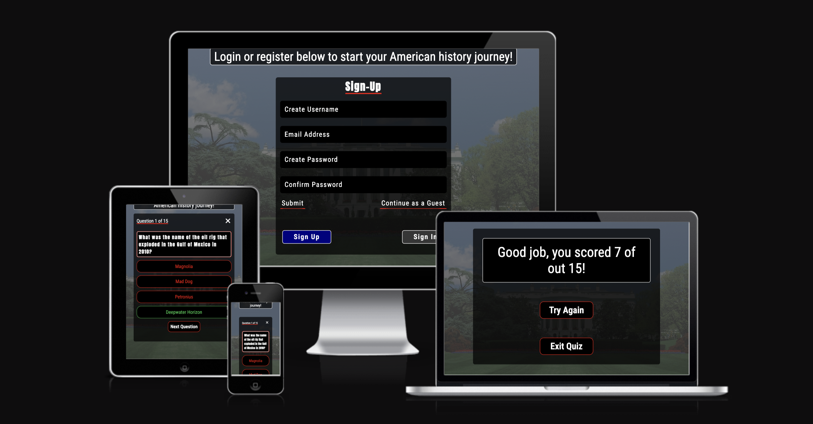
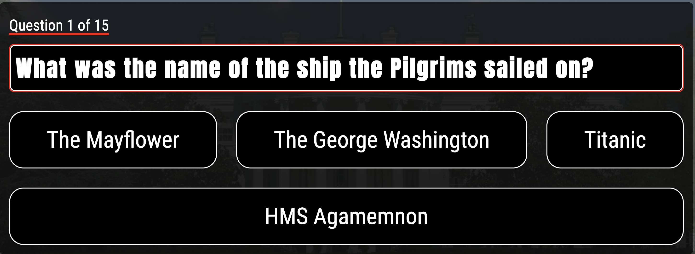
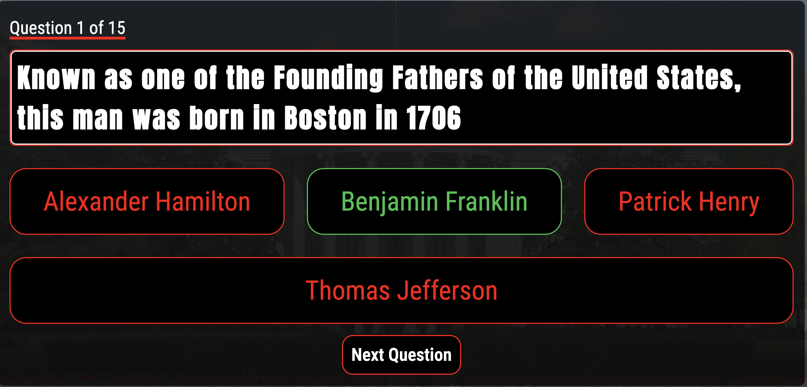
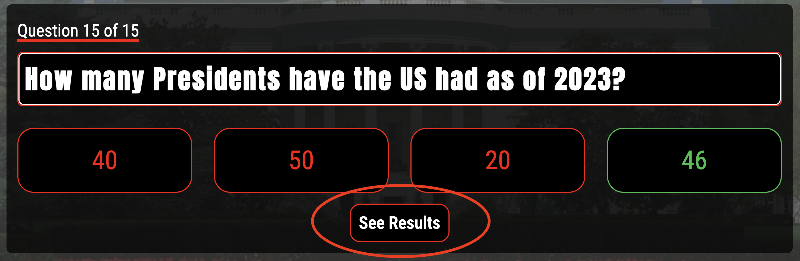

# The Star-Spangled Quiz

Welcome to the Star Spangled Quiz, a quiz surrounding American History from modern day America, right through to the 18th Century. 

View the live sight here - [The Star Spangled Quiz](https://cameronjamesw.github.io/american-history-quiz)

# Contents

* [Introduction](#introduction)
    * [A brief overview](#a-brief-overview)
    * [Target Audience](#target-audience)

* [Deployment](#deployment--local-development)
    * [Deployment](#deployment)
    * [Local Development](#local-development)
        * [How to Fork](#how-to-fork)
        * [How to Clone](#how-to-clone)

* [Design](#design)
    *[Color Scheme](#color-scheme)
    * [Wireframes](#wireframing)
        * [Landing PAge Wireframes](#landing-page-wireframe)
        * [Quiz Window Wireframes](#quiz-window-wireframe)
    * [Features](#features)
        * [Landing Page](#landing-page)
        * [Begin Quiz Window](#begin-quiz-window)
        * [Quiz Window](#quiz-window)
        * [Results Window](#results-window)
        * [Future Implementations](#future-implementations)

* [Technologies Used](#technologies-used)
    * [Languages Used](#languages-used)
    * [Wireframes, Libraries, Programmes](#libraries-frameworks--programmes-used)

* [Manual Testing](#manual-testing)

* [Credit](#credits)
    * [Code Used](#code-used)
    * [Content](#content)
    * [Media](#media)
    * [Acknowledgements](#acknoledgements)

# Introduction

## A Brief Overview

- The purpose of the American History Quiz is to provide students and quiz-enthusiasts alike a vague introduction into American History through the means of engaging in a short but sweet quiz. 

- The questions provided within the quiz of course all surround American historty, from rather obscure questions regarding former Presidents of the country, through to general questions concerning the geography of the 50 states, the quiz is jam packed with an array of questions where every challenger is sure to learn something new. 

## Target Audience

- The target audience of the Star Spangled Quiz are mainly history students and quiz-enthusiasts, as well as the members of the general public who enjoy engaging in the odd quiz from time to time. 

- With the demand for pub quizzes rising throughout the country, a website where the challenger can cycle through a plathora of questions ranging in difficulty is sure to be highly welcomed. 

# Deployment & Local Development

## Deployment

The site is deployed using GitHub Pages - [The Star Spangled Quiz](https://cameronjamesw.github.io/american-history-quiz).

To Deploy the site using GitHub Pages:

1. Login (or signup) to Github.
2. Go to the repository for this project, [cameron-wheatley/american-history-quiz](https://github.com/cameronjamesw/american-history-quiz).
3. Click the settings button.
4. Select pages in the left hand navigation menu.
5. From the source dropdown select main branch and press save.
6. The site has now been deployed, please note that this process may take a few minutes before the site goes live.

## Local Development

### How to Fork

To fork the repository:

1. Log in (or sign up) to Github.
2. Go to the repository for this project, [cameron-wheatley/american-history-quiz](https://github.com/cameronjamesw/american-history-quiz).
3. Click the Fork button in the top right corner.

### How to Clone

To clone the repository:

1. Log in (or sign up) to GitHub.
2. Go to the repository for this project, [cameron-wheatley/american-history-quiz](https://github.com/cameronjamesw/american-history-quiz).
3. Click on the code button, select whether you would like to clone with HTTPS, SSH or GitHub CLI and copy the link shown.
4. Open the terminal in your code editor and change the current working directory to the location you want to use for the cloned directory.
5. Type 'git clone' into the terminal and then paste the link you copied in step 3. Press enter.

# Design

## Color Scheme

- With the quiz surrounding American History, I thought it would be a great idea to utilise the colors of the American Flag as the color pallet for my website. This being because they all contrast excellently with each other therefore maximising accessibilty. 

    - For the main text content I wanted to use `#ffffff`, a very simple color to begin with setting the tone nicely for the rest of the website.
    - I planned to use `#ff0000` for the secondary color as this provides a nice contrast to the white.
    - `#000080` has been used along side `#ff0000` to support the rest of the content, this is used as a border surrounding important buttons in order to bring the users attention to them.
    - finally, I have used `#d3d3d3` as the final color just to complement `#ffffff` and give the website a sleek finish where needs be.

## Wireframing

- Here are the screenshots of the initial wireframes I had created for the quiz website. I have drafted a wireframe for the landing page with the welcome text and registration form, as well as a wireframe for the quiz window.

- The use of wireframing is beneficial to myself and the reader. 
    -  Creating a wireframe allows me to visualise how I want the website to look, and therefore I can begin consider how I will structure this with HTML and CSS. Once the design basics have been noted, I am able to visualise the JavaScript with a considerable amount of depth. Working to a plan presents better results. Furthemore, this will benefit the reader as it will allow them to see the thought process behind the features.

### Landing Page Wireframe

### Quiz Window Wireframe

# Features

## Landing Page
**Heading**

- Above is a screenshot of the header for the website. Straight away, the user will be able to notice that the title of the website is very catchy due to how bold the font weight is, along with the font style `Anton` that has been used,
- Due to the title being nested within the header, the user will be able to see the title at all points of the wuiz, thus reinforcing the brand being estblished by the website. 
- The title adopts the color pallet used by the website, using the main color of white, combining the text-decoration with a strong red. With the theme of the quiz being American History, it makes sense for any supporting colors to be either red or blue. 

**Welcome Text**

- The welcome text is very self-explanitory, it is the text located just underneath the header which welcomes the user and gives them a brief oversight of the quiz they are about to participate in. The purpose of the text is to allow the user to metaphorically 'find their feet', while at the same time encouraging them to sign in/sign up with the form below, thus growing the brand's demographic. 
- The welcome text section of the page upholds the color pallet aforementioned. The background of the boxes which the pieces of text are located in adopt a semi-transparent black background. This background provides an excellent contrast against the body of the website, optimising user accessiblity, whilst upholding the sleek design of the website.

**Sign-Up Form**

- Above the reader will be able to vind a screenshot of the Sign-Up Form which has been created for the website. Upon first glance, it is clear to see that the form continues the aesthetic precedent set by the website, adopting the semi-transparent background, solid white border while using red as a supporting color. The user is able to hover over specific elements of the form and the color/border color will change from white to red, thus implying to the ussr that they are encouraged to click the element. 
- The form allows for the user to sign up to the website in order to access the quiz, if the user has signed up before then they will be able to log-in to their existing account. 
    - Through clicking the 'sign-in' or 'sign-up' buttons located at the bottom of the form, the user will be able to toggle through both sign-in methods. The toggle button hides certain elements of the form corresponding to the option they have selected - clicking 'sign-in' will hide the 'confirm password' field as there is no need for an existing user to confirm an already created password.
    - The user will notice that the placeholder text will also change between both options, switching 'create username/password' to 'enter username/password' respectively.
- Before the user can successfully submit the form, a process of form validation will be executed whereby the username and password will bechecked against certain criteria. When signing up, the username will need to be at least 6 characters  in length and must contain a number. This is the same criteria for the password field too; however, the computer will check to see if both passwords match upon submission. If any of this criteria is not met, then an error message will appear within the form instructing the user to alter the respective field. 
- Upon successfully submitting the form, the user's details shall be logged to the console.
- If the user does not feel a need to log-in or sign-up, then they can select 'continue as a guest' which acts as a way of bypassing the form without having to submit it.

## Begin Quiz Window

- Here is a screenshot of what the user can expect to see upon bypassing the form. A formerly hidden begin quiz window will be revealed to the user and this will allow the user to access the quiz.
- Upon hovering over the begin quiz button, the background color of the box will change from white to red, this enhancing the users experience with the website as this illustrates interactivity to the user.
- Once the user has pressed the button, the quiz window will then be displayed to the user in readiness for them to start the quiz.

## Quiz Window 

**Upon Loading**

- Here is a screenshot of what the user can expect to see upon pressing the begin quiz button. The quiz window will be revealed to the user in a neat transition opening from the top down. The user will see a quiz window containing a question number and a question followed by four answers.
- The aesthetic of the quiz window follows the color pallet that has been set by the rest of the website. When hovering over an answer, the answer box's border color will change to red and the curser will change to a pointer, implying for the user to click the answer which they think it correct `screenshot below`. When moving the mouse cursor out of the answer box, the border color will change back to white, the default color.
- There is an array of 15 questions for the user to answer, with the order of questions being changed each time a user takes the quiz. 

**Selecting An Answer**

- When the user selects an answer they will notice that the color of the answers will change to reflect their status as correct or incorrect. Answers that are correct with adopt a green color with green border, and incorrect answers will adopt a red color with red border.
- When the user selects an answer, the 'next question' button shall be revealed at the bottom of the quiz window, this allows the user to move to the next question `screenshot below`. The 'next question' button has a solid red border, and when hovering the color of the border will change to blue, indicating to the user that this is a button. This contrasts the current precedent set by the color pallet in order to draw attention to it within the quiz window.

**Incrementing Question Number**

- Located at the top of the form, the user will notice some text showing them what queston they are on. This text shows the user the index of the question that they are on.

**See Results Button**

- Once the user has answered all 15 questions, the 'next question' button will be replaced with the 'see results' button. Upon clicking this button, the quiz window will collpase and the user will be shown the results window.
- The 'see results' button follows the same pallet as the 'next question' button. 

## Results Window

**Score Display**

- Upon clicking thed See Results Button, the user will be taken to the results window. Here the first thing they see is the score out of 15 that they achieved.
- The text is contained with a black box with a white border, this giving it an excellent contrast from the rest of the content on the page.

**Try Again Button**

- Below the score box, the user can find 1 of 2 buttons, the first being the Try Again button. This feature maximises user experience for the user as if they want to retry the quiz, or another user wants to try again on the same device, then they are able to reset the quiz without refreshing the browser or bypasing the form. The functionality of this button provides less hassle for the user.
- This button will collapse the results window the user is currently viewing and will in turn reveal the aforementioned Begin Quiz Window. The score is automatically reset to 0 upon clicking this button. 
- As seen in the screenshot above, the button follows the main aesthetic of the website of haviving white text surrounded by a red border, and upon hovering the border color changes to blue.

**Exit Quiz Button**

- The second button that the user can see is the Exit Quiz Button. This button allowsfor the user to collapse the results window, and thus marks the end of the quiz.

## Future Implementations

- In the near future, it is a definite possibility to implement a difficulty level for the user. Granted there is an array of difficulty within the questions provided however, if there is a difficulty selection for the user then this will maximise convenience for any first-time users that are rather new to American History.

- Furthermore, upon doing research into accessibility, it is clear that this website is not very accessible for anyone that is fully color blind. Upon using the Web Disability Simulator through Google Chrome it is clear that there is not much contrast when viewing the quiz window and getting the answers. Therefore in the future it would be ideal to implement further contrast between the answers, whether this is a remodelling of the color pallet, or adding expressive icons to the respective answers. 

# Technologies Used

## Languages Used

HTML, CSS & JavaScript

## Libraries, Frameworks & Programmes Used

* [Google Fonts](https://fonts.google.com/) - Used to import the fonts 

* [GitHub](https://github.com) - To save and store the files for the website

* [GitPod](https://gitpod.io) - IDE used to create the website

* [FontAwesome](https://fontawesome.com/) - Used for an icon on the website

* [Ezigif](https://ezgif.com/video-to-gif) - Used to convert .mov files to gif

* [Google Developer Tools](https://developers.google.com/web/tools) - Used to debug the website as well as test responsive styling

* [Am I Responsive?](http://ami.responsivedesign.is/) To show the website image on a range of devices.

* [Web Disability Simulator](https://chromewebstore.google.com/detail/web-disability-simulator/olioanlbgbpmdlgjnnampnnlohigkjla)

* [Coolors](https://coolors.co/)

# Manual Testing

The Manual Testing can be found [here](TESTING.md)

# Credits

## Code Used

- I took a lot of inspiration from [this YouTube video](https://www.youtube.com/watch?v=LTPGyaEyTI4&t=1195s) where by [Great Stack](https://www.youtube.com/@GreatStackDev) talks through creating log-in/registration form using JavaScript. In particular I took a inspiration for creating a toggle sign-in/sign-up button using this tutorial.

- Whenever I find myself puzzled with JavaScript code that I cannot wrap my head around, I always find myself referring back to [Web Dev Simplified](https://www.youtube.com/c/webdevsimplified) where Kyle does an excellent job at explaining some pretty complex concepts. In particular [this video](https://www.youtube.com/watch?v=riDzcEQbX6k&t=1311s) helped me grasp the concept of one of the best ways to structure a quiz with appending and removing child elements.

## Content

* [Mentimeter](https://www.mentimeter.com/templates/p/american-history-quiz-and-questions) - This is the first webite I used to gather research regarding American History

* [Parade](https://parade.com/living/us-history-trivia-questions) - This is the second website that I used to gather information regarding American History

## Media

* [Clipartix](https://clipartix.com/cartoon-american-flag-image-56708/) - This is the Favicon

* [Alphacoders](https://pics.alphacoders.com/pictures/view/307629) - This is the image of the White House

## Acknoledgements

- I would like to thank my mentor Jubril Akolade for really helping me through this project and reassuring me during times when my motivation was awfully low.

- I would like to thank all of my friends and family who took part in the quiz during and after development to look for bugs and other issues!

