# The Star-Spangled Quiz - Manual Testing

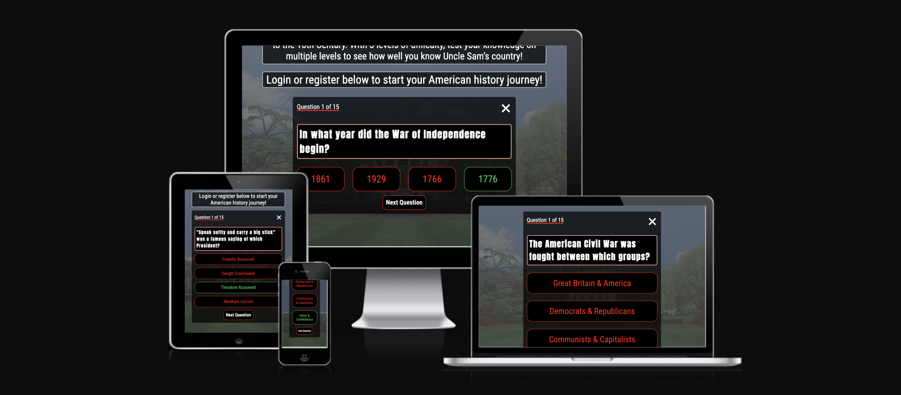

View the live sight here - [The Star Spangled Quiz](https://cameronjamesw.github.io/american-history-quiz)

# Automated Testing

## W3C Validator

[W3C](https://validator.w3.org/) was used to validate the HTML page of the website. It was also used to validate the CSS.

* [index.html](assets/images/validation/w3c-ss.png) - passed, no errors found

* [style.css](assets/images/validation/jigsaw-ss.png) - passed, no errors found

## JSHint Validator

[jshint](https://jshint.com/) was used to validate the JavaScript.

* [script.js](assets/images/validation/jshint-ss.png) - passed, no errors found

## Lighthouse

I used Lighthouse within the Chrome Developer Tools to test the performance, accessibility, best practices and SEO of the website.

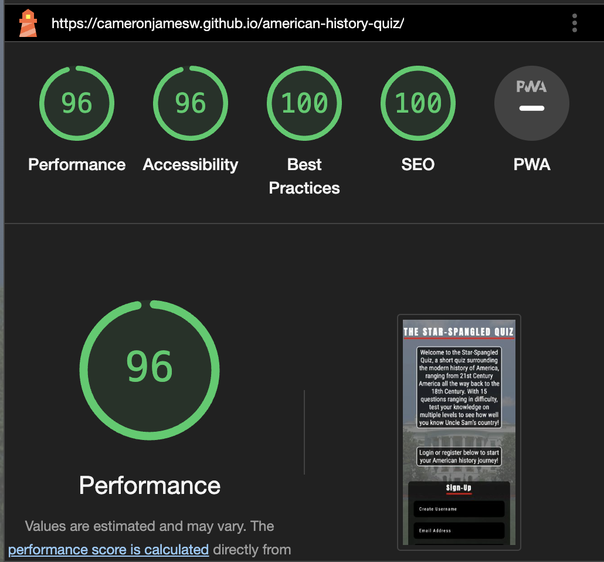

# Manual Testing

## Features Testing

**Form Testing**

Feature | Test Case | Outcome | Screenshtot | Pass or Fail
--- | --- | --- | --- | ---
Hover Form Input | Hover over Input | Border changes color | 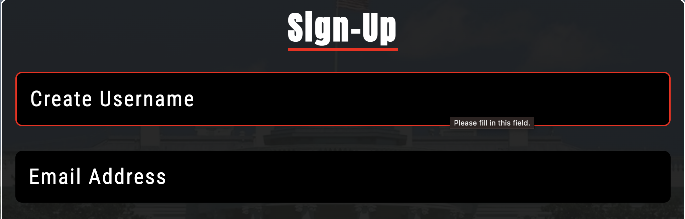 | Pass
Sign-In Toggle Button | Click Sign-In | Reveals Sign-In Window, hides Confirm Password field | 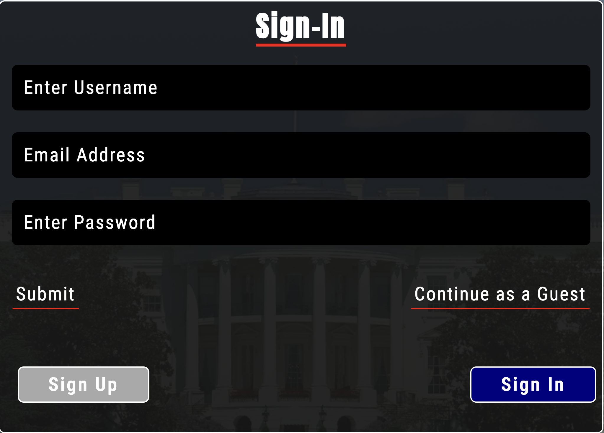 | Pass
Sign-Up Toggle Button | Click Sign-Up | Reveals Sign-Up Window, displays Confirm Password field | 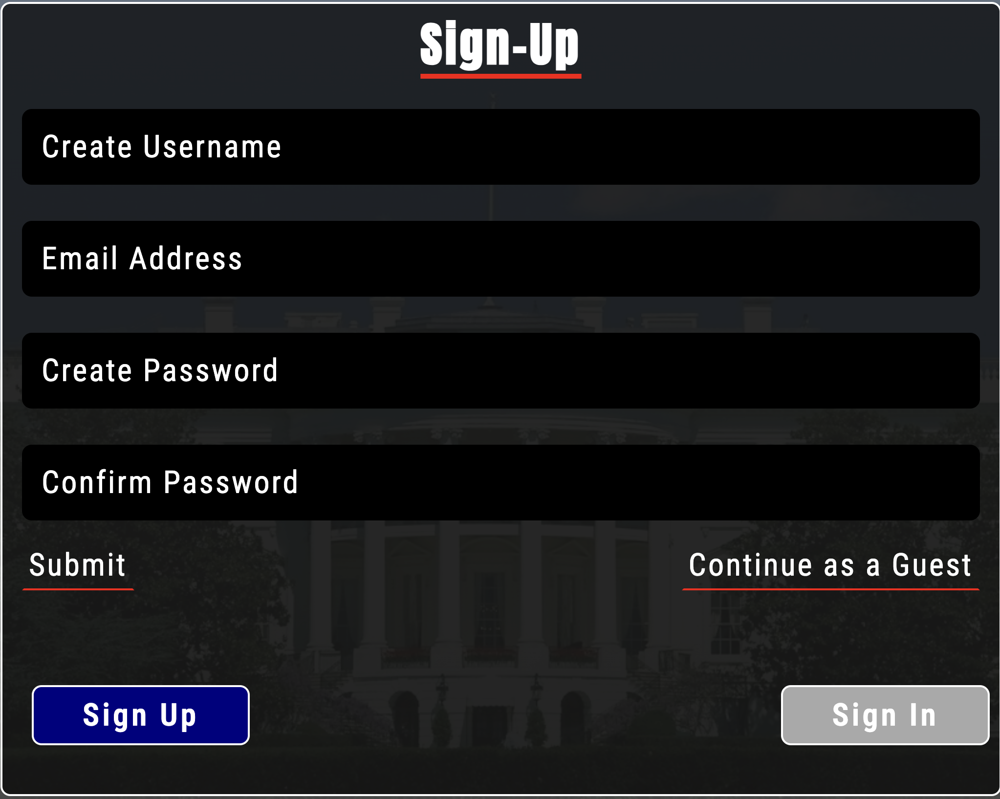 | Pass
Form Validation #1 | Enter Short Username | Displays Relevent Error Msg | 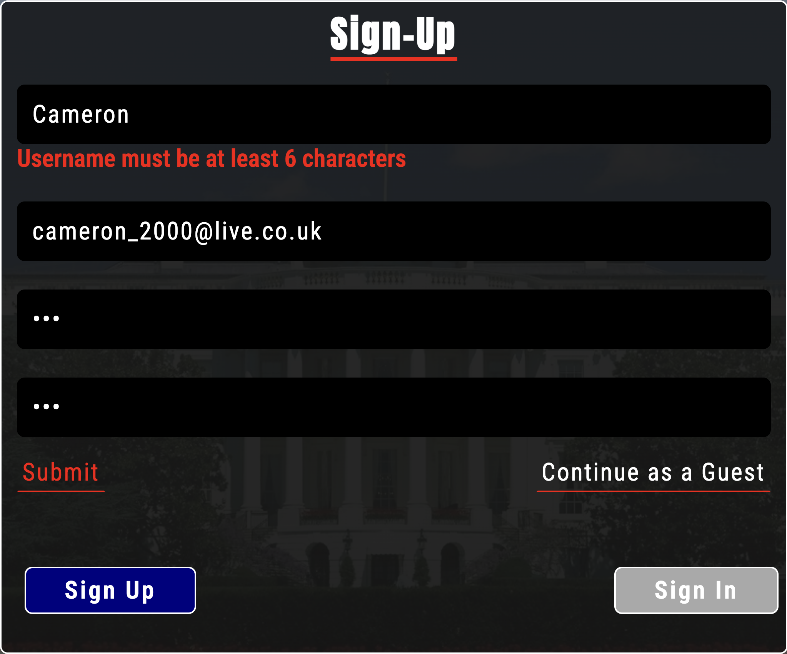 | Pass
Form Validation #2 | Enter Username without Number | Displays Relevent Error Msg | 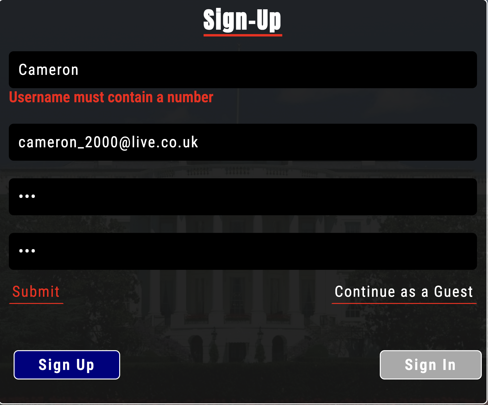 | Pass
Form Validation #3 | Enter Different Passwords | Displays Relevent Error Msg |  | Pss
Form Validation #4 | Enter Short Password | DIsplays Relevent Error Msg | 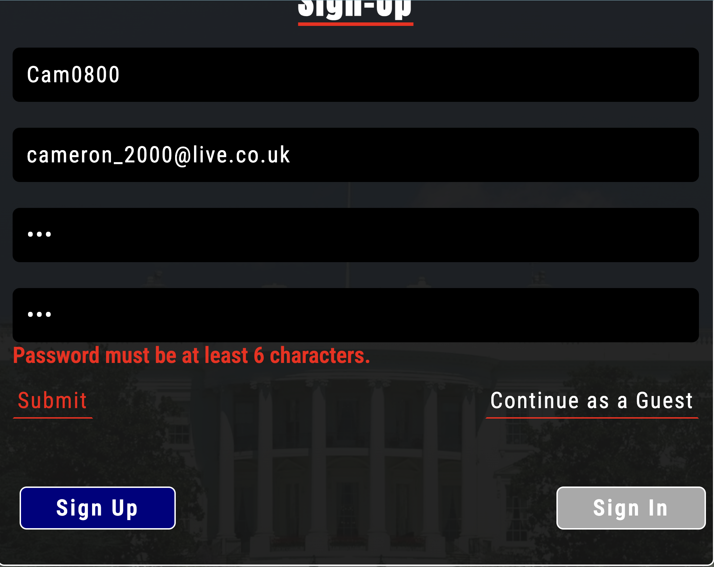 | Pass
Form Validation #5 | Enter Password Without Number | Displays Relevent Error Msg | 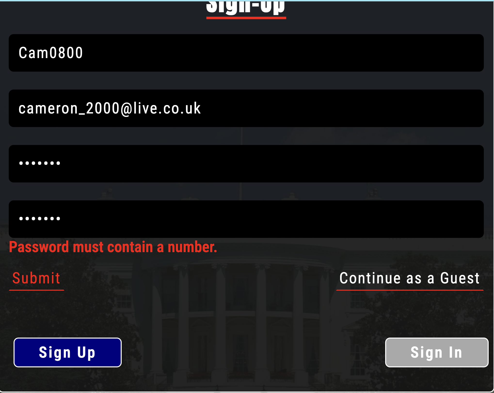 | Pass
Submit Form | Click Submit | Submits form, displays difficulty window |  | Pass
Continue As Guest | Click Continue As Guest | Hides form without submitting, displays difficulty window |  | Pass

**Quiz Window Testing**

Feature | Test Case | Outcome | Screenshot | Pass or Fail
--- | --- | --- | --- | ---
Hover Begin Button | Hover Button | Changes Border & Text Color | 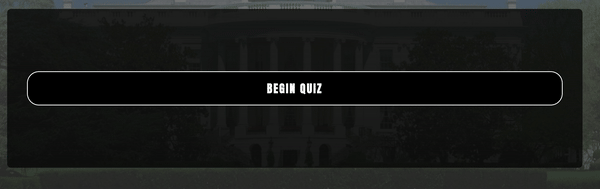 | Pass
Begin Button | Click Button | Hides Begin Window, Shows Quiz Window | 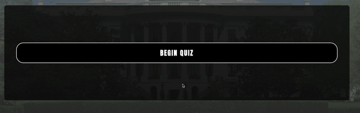 | Pass
Hover Answer Button | Hover Answer | Changes Border & Text Color | 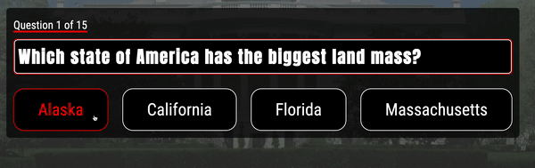 | Pass
Answer Button | Click An Answer | Changes Border & Text Color, reveals next question button | 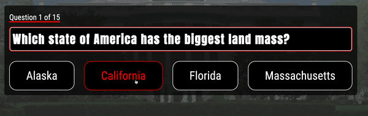 | Pass
Next Question | Click Next Question Button | Shows the next question | 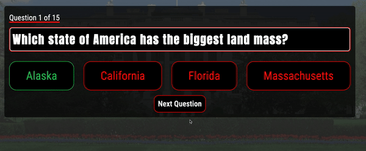 | Pass
See Results | Click See Results Button | Collapses question window, reveals results window | 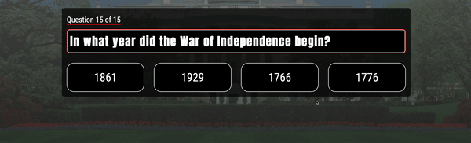 | Pass
X Button | Click X Button | Exit Quiz before reaching the end | 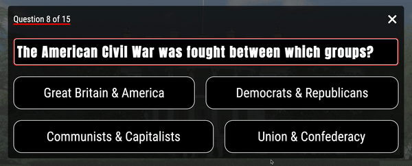 | Pass

**Results Window Testing**

Feature | Test Case | Outcome | Screenshot | Pass or Fail
--- | --- | --- | --- | ----
Count Score | Select 5 correct answers | Displays test of "You Scored 5 out of 15" | 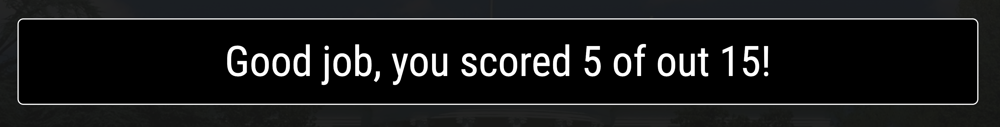 | Pass
Hover Try Again Button | Hover Button | Changes Border Color | 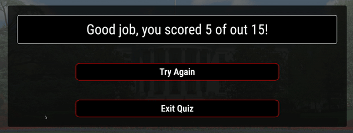 | Pass
Hover Exit Quiz Button | Hover Button | Changes Border Color | 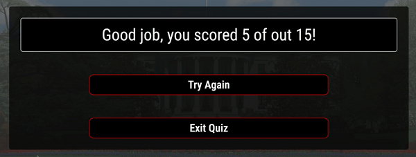 | Pass
Try Again Button | Click Try Again Button | Collapses Results Window, reveals Begin Quiz Window | 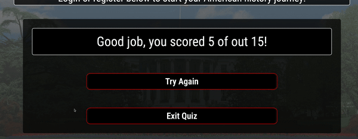 | Pass
Exit Quiz Button | Click Exit Quiz Button | Collapse Results Window | 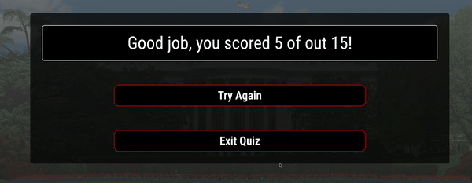 | Pass

## Browser Compatiblity

## Responsiveness

## Code Validation

## Bugs

**Fixed Bugs**

No. | Bug | Expected Outcome | Actual Outcome | Fixed
--- | --- | --- | --- | ---
1 | No questions in the question window | Questions displayed upon clicking begin | 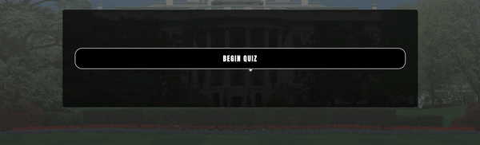 | Yes

**Known Bugs** 

No. | Bug | Expected Outcome | Actual Outcome
--- | --- | --- | ---
1 | Clicking the last answer multiple times will duplicate the See Results button | See Results button only displayed once | 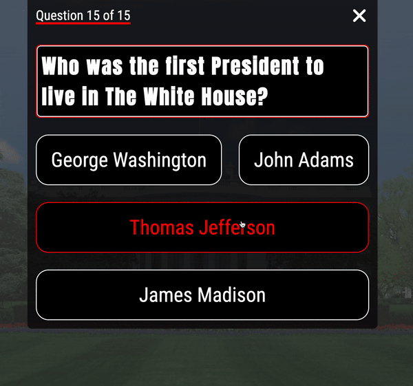
2 | Clicking the correct answer multiple times will increment score | Only incrementing the score once if answer is correct | 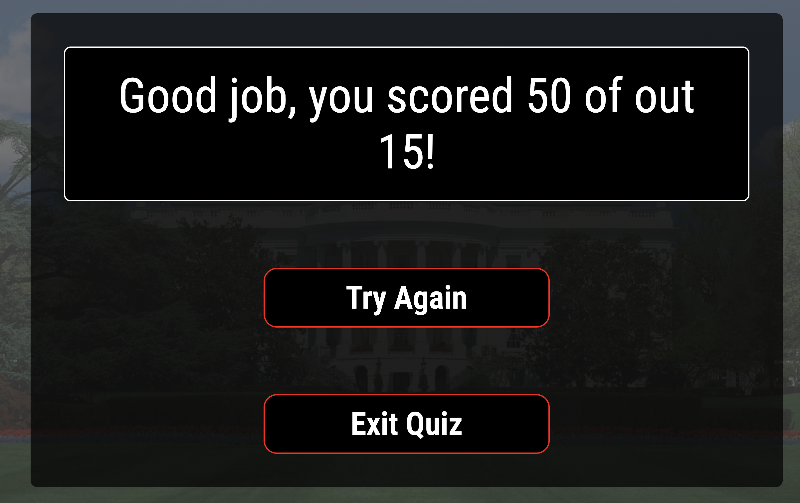
3 | Background image scrolls with page on iOS Devices despite having fixed attribute | Content scrolls on top of a fixed background | 

## Lighthouse

## Accessibility