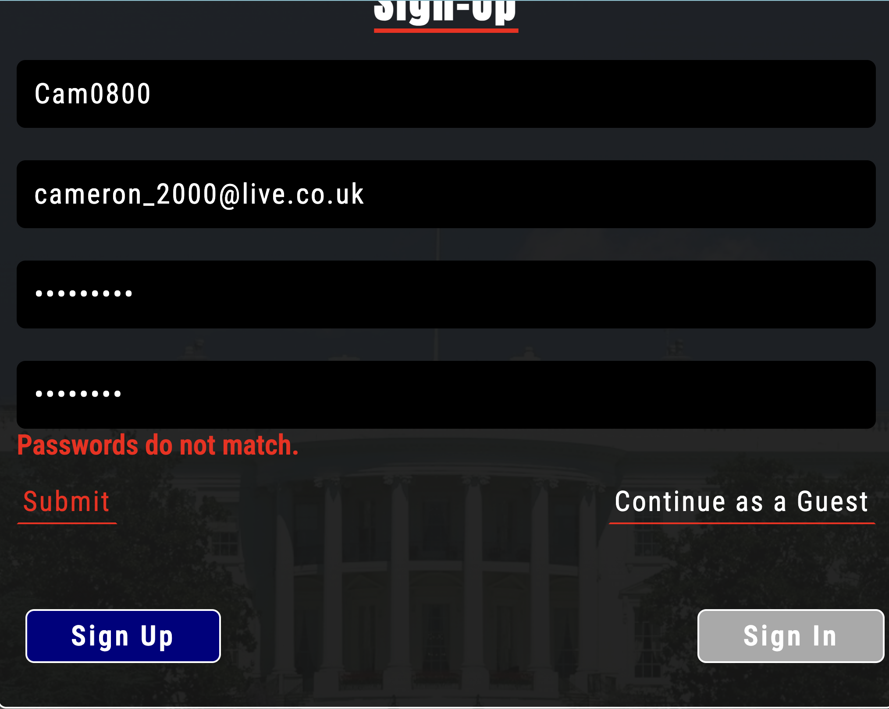
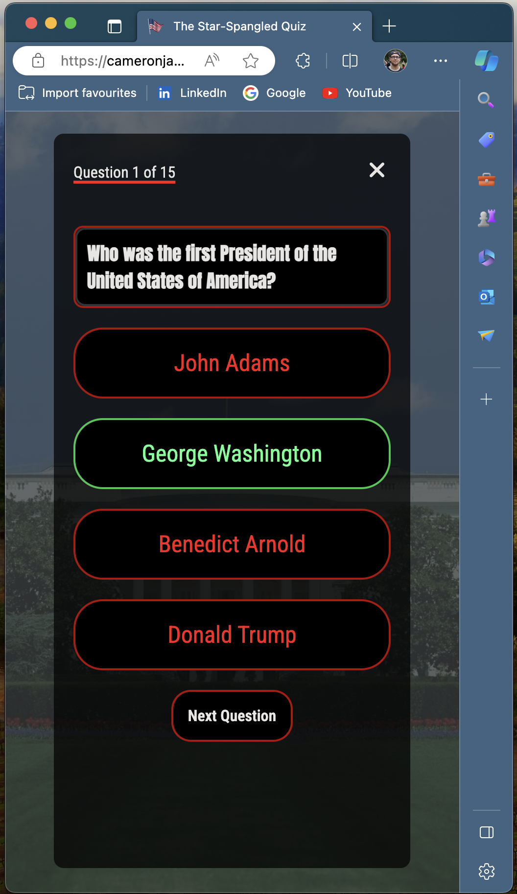

# The Star-Spangled Quiz - Testing

View the live sight here - [The Star Spangled Quiz](https://cameronjamesw.github.io/american-history-quiz)

# Testing Contents

* [Automated Testing](#automated-testing)
    * [W3C Validator](#w3c-validator)
    * [JSHint Validator](#jshint-validator)
    * [Lighthouse](#lighthouse)
* [Manual Testing](#manual-testing)
    * [Features Testing](#features-testing)
    * [Browser Compatibilty & Responsivity](#browser-compatiblity--responsiveness)
    * [Bugs](#bugs)
    * [Accessiblity](#accessibility)

# Automated Testing

## W3C Validator

[W3C](https://validator.w3.org/) was used to validate the HTML page of the website. It was also used to validate the CSS.

* [index.html](assets/images/validation/w3c-ss.png) - passed, no errors found

* [style.css](assets/images/validation/jigsaw-ss.png) - passed, no errors found

## JSHint Validator

[jshint](https://jshint.com/) was used to validate the JavaScript.

* [script.js](assets/images/validation/jshint-ss.png) - passed, no errors found

## Lighthouse

I used Lighthouse within the Chrome Developer Tools to test the performance, accessibility, best practices and SEO of the website.

# Manual Testing

## Features Testing

**Form Testing**

Feature | Test Case | Outcome | Screenshtot | Pass or Fail
--- | --- | --- | --- | ---
Hover Form Input | Hover over Input | Border changes color |  | Pass
Sign-In Toggle Button | Click Sign-In | Reveals Sign-In Window, hides Confirm Password field |  | Pass
Sign-Up Toggle Button | Click Sign-Up | Reveals Sign-Up Window, displays Confirm Password field |  | Pass
Form Validation #1 | Enter Short Username | Displays Relevent Error Msg |  | Pass
Form Validation #2 | Enter Username without Number | Displays Relevent Error Msg |  | Pass
Form Validation #3 | Enter Different Passwords | Displays Relevent Error Msg |  | Pss
Form Validation #4 | Enter Short Password | DIsplays Relevent Error Msg |  | Pass
Form Validation #5 | Enter Password Without Number | Displays Relevent Error Msg |  | Pass
Submit Form | Click Submit | Submits form, displays difficulty window |  | Pass
Continue As Guest | Click Continue As Guest | Hides form without submitting, displays difficulty window |  | Pass

**Quiz Window Testing**

Feature | Test Case | Outcome | Screenshot | Pass or Fail
--- | --- | --- | --- | ---
Hover Begin Button | Hover Button | Changes Border & Text Color |  | Pass
Begin Button | Click Button | Hides Begin Window, Shows Quiz Window |  | Pass
Hover Answer Button | Hover Answer | Changes Border & Text Color |  | Pass
Answer Button | Click An Answer | Changes Border & Text Color, reveals next question button |  | Pass
Next Question | Click Next Question Button | Shows the next question |  | Pass
See Results | Click See Results Button | Collapses question window, reveals results window |  | Pass
X Button | Click X Button | Exit Quiz before reaching the end |  | Pass

**Results Window Testing**

Feature | Test Case | Outcome | Screenshot | Pass or Fail
--- | --- | --- | --- | ----
Count Score | Select 5 correct answers | Displays test of "You Scored 5 out of 15" |  | Pass
Hover Try Again Button | Hover Button | Changes Border Color |  | Pass
Hover Exit Quiz Button | Hover Button | Changes Border Color |  | Pass
Try Again Button | Click Try Again Button | Collapses Results Window, reveals Begin Quiz Window |  | Pass
Exit Quiz Button | Click Exit Quiz Button | Collapse Results Window |  | Pass

## Browser Compatiblity & Responsiveness

Browser | width > 768px | width > 1024px | 1024px < width | pass/fail
--- | --- | --- | --- | ---
Chrome |  |  | | Pass
Safari |  |  |  | Pass
FireFox |  |  |  | Pass
Microsoft Edge |  |  |  | Pass

## Bugs

**Fixed Bugs**

No. | Bug | Expected Outcome | Actual Outcome | Fixed
--- | --- | --- | --- | ---
1 | No questions in the question window | Questions displayed upon clicking begin |  | Yes
2 | Clicking the last answer multiple times will duplicate the See Results button | See Results button only displayed once |  | Yes
3 | Clicking the correct answer multiple times will increment score | Only incrementing the score once if answer is correct |  | Yes
4 | When reseting quiz, see result button would not show | See Results button displayed after last question |  | Yes

**Known Bugs** 

No. | Bug | Expected Outcome | Actual Outcome
--- | --- | --- | ---
1 | Background image scrolls with page on iOS Devices despite having fixed attribute | Content scrolls on top of a fixed background | 

## Accessibility

I have been mindful during coding to ensure that the website is as accessible friendly as possible. This has been have achieved by:

* Using a semantic HTML structure.
* Using a hover state on all buttons on the site to make it clear to the user if they are hovering over a button.
* Choosing a sans serif font for the site - these fonts are suitable for people with dyslexia.
* Ensuring that there is a sufficient colour contrast throughout the site regarding the meaninful content.

Using the Web Disability Simulator within Google Chrome Dev Tools, I have been able to test the website against some of the major accessiblity impairments. With both green and red being important colors within the color scheme, I was interested to see how somebody with this visual impairment would see the website. Here is the result.. 

When considering implementing future features, it would be very beneficial to accompany the visual impairment of being fully color blind. Through doing some research earlier, it has become clear to me that the quiz window of my website is not very accessible to someone with this visual impairment. 

